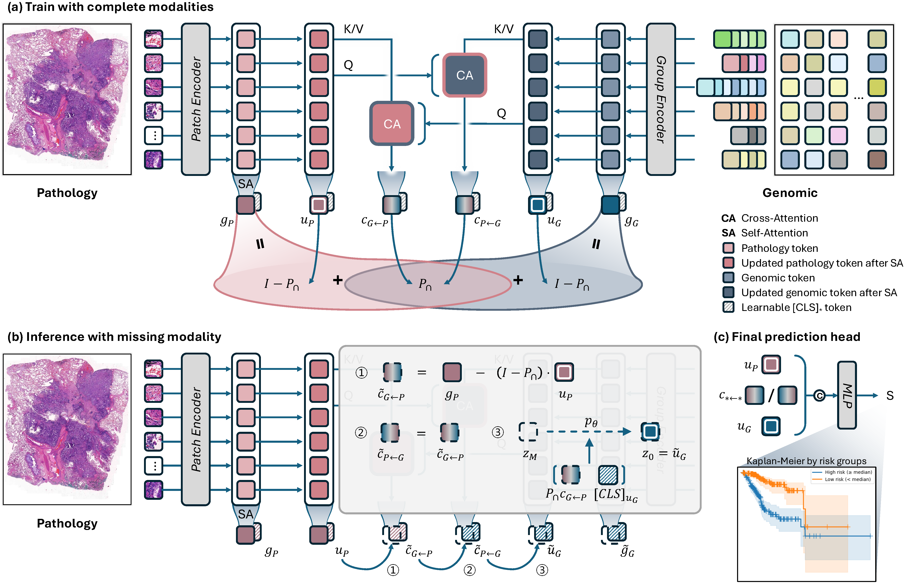

<div align="center">

# MUST

### Modality-Specific Representation-Aware Transformer for<br>Diffusion-Enhanced Survival Prediction with Missing Modality

<p>
    <a href="https://kylekwkim.github.io/MUST/"></a>&nbsp;
    <a href="https://arxiv.org/abs/2603.26071"></a>&nbsp;
    <a href="https://arxiv.org/pdf/2603.26071"></a>
</p>

**CVPR 2026** &nbsp;|&nbsp; Kyungwon Kim · Dosik Hwang

<p>
  
</p>

</div>

## 📢 Updates

- **[2026.03]** 🎉 arXiv preprint released — [[2603.26071]](https://arxiv.org/abs/2603.26071)
- **[2026.03]** Paper accepted at **CVPR 2026**!

## 📄 Abstract

Accurate survival prediction from multimodal medical data is essential for precision oncology, yet clinical deployment faces a persistent challenge: modalities are frequently incomplete due to cost constraints, technical limitations, or retrospective data availability. We propose **MUST**, a novel framework that explicitly decomposes each modality's representation into modality-specific and cross-modal contextualized components through algebraic constraints in a learned low-rank shared subspace. This decomposition enables precise identification of what information is lost when a modality is absent. For the truly modality-specific information that cannot be inferred from available modalities, we employ conditional latent diffusion models to generate high-quality representations conditioned on recovered shared information and learned structural priors. Extensive experiments on five TCGA cancer datasets demonstrate that MUST achieves state-of-the-art performance with complete data while maintaining robust predictions in both missing pathology and missing genomics conditions.

## ✨ Highlights

- **Algebraic Decomposition** — Explicit separation of modality-specific and shared components through low-rank subspace constraints, enabling deterministic recovery of shared information from any available modality.
- **Diffusion-Based Generation** — Conditional latent diffusion models synthesize missing modality-specific components, isolating stochastic generation to truly unique residuals only.
- **Bidirectional Symmetry** — Handles both missing pathology and missing genomics scenarios symmetrically, unlike prior unidirectional approaches.

## 🚀 Coming Soon

- [ ] Code release

## 📌 Citation

If you find this work useful, please consider citing:

```bibtex
@misc{kim2026mustmodalityspecificrepresentationawaretransformer,
      title={MUST: Modality-Specific Representation-Aware Transformer for Diffusion-Enhanced Survival Prediction with Missing Modality}, 
      author={Kyungwon Kim and Dosik Hwang},
      year={2026},
      eprint={2603.26071},
      archivePrefix={arXiv},
      primaryClass={cs.CV},
      url={https://arxiv.org/abs/2603.26071}, 
}
```

## 🙏 Acknowledgements

This work was supported by the National Research Foundation of Korea (NRF) grant funded by the Korea government (MSIT) (No. RS-2025-16070382, RS-2025-02215070, RS-2025-02217919), Artificial Intelligence Graduate School Program at Yonsei University (RS-2020-II201361), the Korea Institute of Science and Technology (KIST) Institutional Program under Grant 26E0170.
